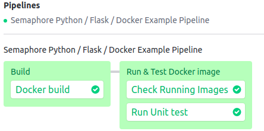

# A Semaphore demo CI/CD pipeline using Docker based Python / Flask / MongoDB application

[](https://semaphore-demos.semaphoreci.com/projects/semaphore-demo-python-flask)

Example of Docker based, Python Flask MongoDB application and CI/CD pipeline for integrating it with Semaphore 2.0. This application demonstrates CRUD operations using Flask and MongoDB as database. It also includes UI for all CRUD views.

# Local project setup

1. Fork this repository and clone into your local

2. Make sure, you have docker-compose and docker installed on your machine

3. Run following docker-compose command
   ```
   docker-compose up
   ```
4. That's all. Visit localhost:5000 from your browser, You'll see flask application           running.

# CI/CD on Semaphore

Fork this repository and use it to [create a project](https://docs.semaphoreci.com/article/63-your-first-project)
   ```
   curl https://storage.googleapis.com/sem-cli-releases/get.sh | bash
   sem connect <semaphore-organization-link> <semaphore-id> // found in Semaphore Dashboard
   cd <project directory>
   sem init
   ```

Install [SEM CLI](https://docs.semaphoreci.com/article/53-sem-reference#download-and-install) into your local

Create your Docker credential file using metadata name as pyflask-semaphore and encrypt it with SEM CLI tool that is installed in previous step [How To](https://docs.semaphoreci.com/article/66-environment-variables-and-secrets)

Once everything will setup appropriately as descibed in above steps, The CI pipeline will look like this:



The example pipeline contains 2 blocks:

* Build
   * Docker build
* Run Docker Image
   * Run latest Docker image
